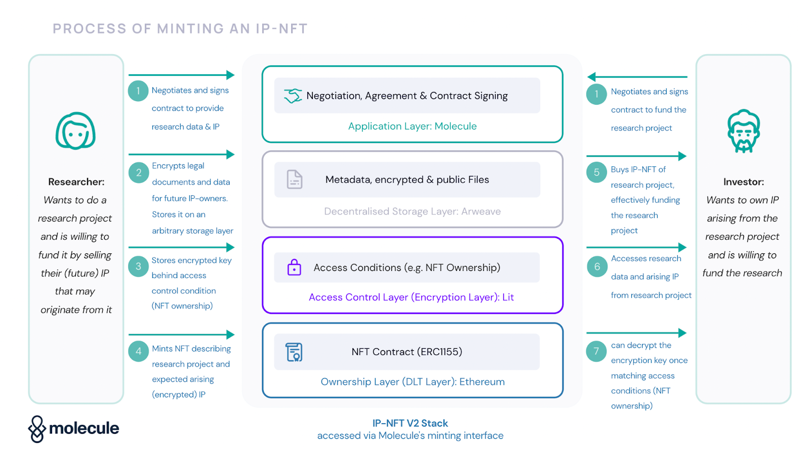

# Design Doc: First iteration of MVP - Securing patents on-chain

# Introduction

Here we discuss the technical solution for the first iteration of DeepVenture’s MVP which includes registering of individual off-chain patents from traditional IP offices and their securement on-chain by ….

# Requirements

- User sign up/in;
- Registering off-chain patents;
- Viewing and searching for off-chain and on-chain patents;
- Verifying authenticity of patents (at first, a manual verification upon user request);
- Securing patents on-chain as IP-NFTs.

# Design approach

Below there is a description of a solution for the above requirements developed around a JavaScript, Solidity, GraphQL and SQL tech stack.

## Backend

The application will require a centralized backend for gateway integrations and off-chain patents data persistency. For that, we are going to use [NestJS](https://nestjs.com/) for expressive and modular development of a Node.js and a GraphQL server. We should opt for GraphQL instead of a REST API to be able to integrate seamlessly with a [Subgraph](https://thegraph.com/) (more on this on “Database/Indexing” section) and merge off-chain with on-chain data from various indexing sources as in a [federation](https://www.apollographql.com/docs/federation/).

In regards to authentication, if we opt for a web3 approach we can use the [Sign In With Ethereum](https://login.xyz/) standard ([EIP-4361](https://eips.ethereum.org/EIPS/eip-4361)) to enable users to sign in as merely connecting a wallet doesn’t work as authentication when you have a centralized backend.

## Smart contracts

Here we can leverage [Molecule’s IP-NFT framework](https://docs.molecule.to/documentation/ip-nft-protocol/intro-to-ip-nft) in order to ship our product faster. Their standard includes minting IP-NFTs, storing encrypted data on decentralized infrastructure and gating access based on ownership of IP-NFT. Below you can find a diagram that illustrates each step of minting and selling an IP-NFT:

At this moment, as we are only concerned with securing IP on-chain, we can consider a partial integration of the first four steps of the above diagram.

For smart contract development, we use [Hardhat](https://hardhat.org/) as our development environment. 

## Decentralized storage

By default, Molecule’s IP-NFT framework uses Arweave as its storage layer and takes advantage of its data permanence, however, this comes at a much higher financial cost per giga-byte stored on their infrastructure when compared to IPFS. We can opt for IPFS and have its lack of data permanence guarantees remedied by using pinning services such as Filecoin, however, this comes at the expense of modifying Molecule’s IP-NFT framework code.

The easiest way to integrate with such decentralized storage options is through gateways, as it’s as simple as a REST API call and doesn’t require management of any extra infrastructure from our side.

## Database/Indexing

In order to store and index patents data before they are secured on-chain, we can use [PostgreSQL](https://www.postgresql.org/) as our relational database system as the application’s data structure is pretty much tabular.

For on-chain and decentralized storage data, we need to go further and add an indexing layer as data on such systems isn’t searchable. Currently, the industry standard for this is [The Graph](https://thegraph.com/), a tool built on top of PostgreSQL and GraphQL that allows developers to create Subgraphs for decentralized applications, making blockchain data indexing a breeze (without it, it’s a very difficult task due to chain reorganizations, dropped and uncle blocks etc.).

## Frontend

Currently, React is the most widely used frontend development library and NextJS brings extended functionality to it especially related to server-side rendering (crucial for SEO!) and fast distribution. With NextJS, we can also “eject” and generate an static version of the frontend that can be hosted on IPFS for decentralization of the frontend.

To connect with our data APIs, we use [Apollo](https://www.apollographql.com/) as a GraphQL client and plug it to both our backend’s GraphQL API and our Subgraph’s API. 

For styling, we should consider using [Tailwind](https://tailwindcss.com/), a very flexible CSS library that streamlines all sorts of UI component development.

# User interface design

[https://www.figma.com/embed?embed_host=notion&url=https%3A%2F%2Fwww.figma.com%2Fproto%2F7rUODqtL9nGB9Fw4oODZG2%2FDeepVenture](https://www.figma.com/embed?embed_host=notion&url=https%3A%2F%2Fwww.figma.com%2Fproto%2F7rUODqtL9nGB9Fw4oODZG2%2FDeepVenture)

# Component design

Molecule’s IP-NFT metadata structure: [https://ipfs.io/ipfs/bafkreidvntjwclitnjnk25qe6gcjxqgjthfm5ilx7rsotrnh2k2tooeara](https://ipfs.io/ipfs/bafkreidvntjwclitnjnk25qe6gcjxqgjthfm5ilx7rsotrnh2k2tooeara)

# Testing and quality assurance

For any custom smart contract, we’ll have a test-driven development approach with [Hardhat’s Mocha plugin](https://hardhat.org/tutorial/testing-contracts). The smart contracts should also take advantage of [OpenZeppelin](https://www.openzeppelin.com/)’s time-proven standard implementations. [Formal verification](https://ethereum.org/en/developers/docs/smart-contracts/formal-verification/) can be added in tandem with the test-driven development approach as we grow in complexity.

We can consider improving testing and other processes with [Tenderly](https://tenderly.co/) automation in the future, as well as including their gas profiling analysis for capturing opportunities of efficiency improvement.

Another quality assurance protocol will of course be third-party auditing. 

# Deployment and maintenance

## Backend

NestJS server: [Digital Ocean](https://www.digitalocean.com/) (12 USD[/](https://web3.storage/)mo). CI/CD.

## Smart contracts

Initially, we can trigger deployments manually from our computers as needed with Hardhat CLI. For this, we need to connect to a node of our blockchain of choice and this can be performed through node-as-a-service integrations from companies such as [Alchemy](https://www.alchemy.com/) or [Infura](https://www.infura.io/) on their free-tier.

## Decentralized storage

IPFS + Filecoin: [https://web3.storage/](https://web3.storage/) (free tier, initially). No deployment needed.

## Database[/](https://web3.storage/)Indexing

Postgres database: [Digital Ocean](https://www.digitalocean.com/) (15 USD[/](https://web3.storage/)mo). One-time manual setup.

Subgraph: we can deploy it to a Digital Ocean centralized virtual machine (12 USD[/](https://web3.storage/)mo) or to the The Graph decentralized network (it has an [average cost of $0.0002 per query](https://thegraph.com/docs/en/network/benefits/) paid in GRT).

## Frontend

[Netlify](https://www.netlify.com/) (free tier). CI/CD.

# Monitoring

We can consider using [Tenderly](https://tenderly.co/) to monitor on-chain activity with alerts once we deploy to production, but this is something we can add later and won’t affect our design approach now.

# Conclusion

This design doc outlines a solution for securing patents on-chain that is underpinned by Molecule’s IP-NFT framework and standard approaches for web and Solidity development based on current most used tools. Molecule’s framework, despite being simple, can offer unexpected challenges in case our needs don’t align completely with their solution as we progress.